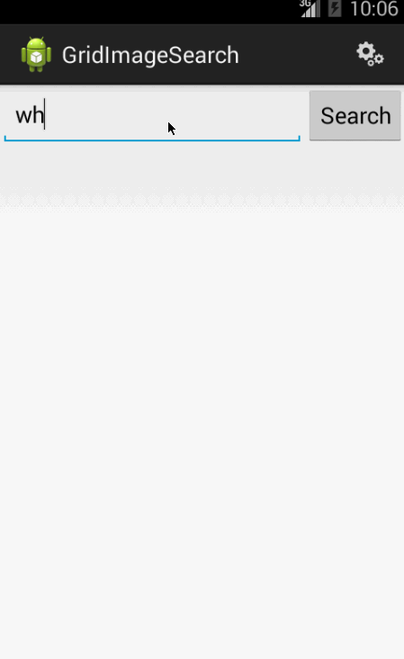

# Android Grid Image App

This app allows users to search Google images and view results in a grid, select specific images and filter searches based on specific riteria

Time spent: 6 hours

Completed user stories:

 * [x] User can enter a search query that will display a grid of image results from the Google Image API.
 * [x] User can click on "settings" which allows selection of advanced search options to filter results
 * [x] User can configure advanced search filters such as:
   * [x] Size (small, medium, large, extra-large)
   * [x] Color filter (black, blue, brown, gray, green, etc...)
   * [x] Type (faces, photo, clip art, line art)
   * [x] Site (espn.com)
 * [x] Subsequent searches will have any filters applied to the search results
 * [x] User can tap on any image in results to see the image full-screen
 * [x] User can scroll down “infinitely” to continue loading more image results (up to 8 pages)
 * [ ] Optional: Use the ActionBar SearchView or custom layout as the query box instead of an EditText
 * [x] Optional: User can share an image to their friends or email it to themselves
 * [ ] Optional: Robust error handling, check if internet is available, handle error cases, network failures
 * [ ] Optional: Improve the user interface and experiment with image assets and/or styling and coloring
 * [ ] Stretch: Replace Filter Settings Activity with a lightweight modal overlay
 * [ ] Stretch: User can zoom or pan images displayed in full-screen detail view
 * [ ] Stretch: Use the StaggeredGridView to display visually interesting image results

Walkthrough of all user stories:

GIF created with [LiceCap](http://www.cockos.com/licecap/).
